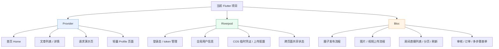

# Flutter 状态管理技术总结

## 1. 文档目的

本文结合当前项目的实际代码结构，系统梳理 Flutter 框架的核心原理、渲染机制、状态管理方案、依赖注入方式以及生命周期管理策略，并进一步分析当前项目各模块适合采用的状态管理方案。

本文重点回答以下问题：

- Flutter 的 UI 是如何渲染出来的
- 当前项目使用了什么状态管理方案
- `Provider / Riverpod / Bloc / GetX` 各自适合什么场景
- 当前项目中哪些模块适合继续用 `Provider`
- 哪些模块适合迁移到 `Riverpod` 或 `Bloc`
- 如何设计依赖注入与生命周期管理

---

## 2. Flutter 框架原理与渲染机制

Flutter 是一个声明式 UI 框架。它的核心思想不是“直接操作 UI 控件”，而是“通过状态描述 UI，状态变化后自动重新构建界面”。

### 2.1 三棵树模型

Flutter 的界面构建依赖三棵树：

#### Widget Tree
Widget 是 UI 的配置描述，通常是不可变对象。

例如：

```dart
MaterialApp(
  home: HomePage(),
)
```

Widget 只负责描述“长什么样”，并不直接绘制。

#### Element Tree
Element 是 Widget 和 RenderObject 之间的桥梁，负责：

- 挂载 Widget
- 记录 Widget 的生命周期
- 比较前后 Widget 差异
- 决定哪些部分需要更新

#### RenderObject Tree
RenderObject 是真正参与布局和绘制的对象，负责：

- 测量尺寸
- 布局计算
- 绘制像素到屏幕

### 2.2 Flutter 的重建机制

Flutter 的刷新本质上是：

1. 状态变化
2. 触发 `setState()`、`notifyListeners()` 或其它状态更新机制
3. 相关 Widget 重新执行 `build()`
4. Flutter 进行树差异比对
5. 尽量复用已有 Element 和 RenderObject

因此，Flutter 的性能关键在于：

- 避免不必要的 rebuild
- 合理拆分 Widget
- 让状态尽量局部化

### 2.3 为什么 Flutter 渲染效率高

Flutter 渲染效率较高，主要原因包括：

- 不依赖原生控件逐层映射
- UI 由 Flutter 引擎统一绘制
- 声明式 UI 降低命令式更新复杂度
- Widget 轻量，重建成本低

---

## 3. 当前项目的状态管理现状

结合当前项目代码，状态管理主线是：

- `provider`
- `ChangeNotifier`
- `Repository`
- `ViewModel`

### 3.1 项目入口的状态注入

`lib/app.dart` 中使用 `MultiProvider` 在根节点注入多个 ViewModel：

```1:28:lib/app.dart
import 'package:flutter/material.dart';
import 'package:provider/provider.dart';

import 'core/helpers/app_constants.dart';
import 'router/app_router.dart';
import 'router/app_routes.dart';
import 'theme/app_theme.dart';
import 'viewmodels/article_detail_view_model.dart';
import 'viewmodels/article_list_view_model.dart';
import 'viewmodels/home_view_model.dart';
import 'viewmodels/request_view_model.dart';

class MyApp extends StatelessWidget {
  const MyApp({super.key});

  @override
  Widget build(BuildContext context) {
    return MultiProvider(
      providers: [
        ChangeNotifierProvider(create: (_) => HomeViewModel()),
        ChangeNotifierProvider(create: (_) => ArticleListViewModel()),
        ChangeNotifierProvider(create: (_) => ArticleDetailViewModel()),
        ChangeNotifierProvider(create: (_) => RequestViewModel()),
      ],
      child: MaterialApp(
```

这说明当前项目采用的是典型的“根部注入 + 页面消费”模式。

### 3.2 ViewModel 的实现方式

例如 `HomeViewModel`：

```1:74:lib/viewmodels/home_view_model.dart
class HomeViewModel extends ChangeNotifier {
  HomeViewModel({HomeRepository? repository}) : _repository = repository ?? HomeRepository();

  final HomeRepository _repository;

  ViewStatus _status = ViewStatus.initial;
  String? _errorMessage;
  List<HomeMenuItem> _menus = const [];
  AccompanyCategoryDetailEntity? _accompanyCategoryDetail;

  BannerResposeEntity? _bannerResposeEntity;

  ViewStatus get status => _status;
  String? get errorMessage => _errorMessage;
  List<HomeMenuItem> get menus => _menus;
  AccompanyCategoryDetailEntity? get accompanyCategoryDetail => _accompanyCategoryDetail;
```

它的典型特点是：

- 持有页面状态
- 通过 `notifyListeners()` 通知 UI 刷新
- 通过 Repository 获取数据
- 用 `ViewStatus` 管理加载/成功/错误/空态

这是一种非常典型的 `ViewModel + ChangeNotifier` 写法。

---

## 4. Flutter 状态管理方案详解

### 4.1 Provider

`Provider` 是当前项目已经在使用的方案。

#### 核心特点

- 基于 InheritedWidget 封装
- 通过 `ChangeNotifier` 推动界面刷新
- 学习成本低
- 很适合中小型项目

#### 优点

- 简单直接
- 与 Flutter 生态融合自然
- 上手快
- 适合当前项目这种分层清晰的结构

#### 缺点

- 对 `BuildContext` 依赖较强
- 多层嵌套后可读性下降
- 依赖关系较复杂时维护难度增加
- 测试能力不如 Riverpod

#### 适用场景

- 首页、列表页、详情页
- 状态变化不频繁的模块
- 已经按 ViewModel 拆分好的业务层

---

### 4.2 Riverpod

Riverpod 可以看作是 Provider 的现代化升级。

#### 核心特点

- 不依赖 `BuildContext`
- 依赖声明更清晰
- 更适合复杂项目
- 测试友好

#### 优点

- 依赖注入更自然
- 状态组合能力强
- 支持更好的可测试性
- 更适合全局状态管理

#### 缺点

- 学习成本高于 Provider
- 现有 Provider 项目迁移需要一定成本
- 团队需要统一写法

#### 适用场景

- 全局登录态
- 用户信息
- token / session
- 上传配置
- 跨页面共享状态
- 与网络层强关联的状态

---

### 4.3 Bloc

Bloc 的核心思想是：

- 事件驱动
- 单向数据流
- 输入事件，输出状态

#### 核心特点

- 状态流转清晰
- 事件与状态分离
- 适合复杂业务流程

#### 优点

- 状态变化路径清晰
- 适合流程型业务
- 便于排查和回放状态流转
- 团队协作可控性强

#### 缺点

- 样板代码多
- 小项目显得偏重
- 学习门槛比 Provider 高

#### 适用场景

- 圈子发布流程
- 上传流程
- 订单流程
- 审核流程
- 多步骤表单
- 状态机明显的业务

---

### 4.4 GetX

GetX 强调快速开发，整合了状态管理、依赖注入和路由。

#### 核心特点

- 简洁
- 快速
- 写法少

#### 优点

- 开发效率高
- 适合快速验证需求
- API 简单

#### 缺点

- 项目大了后容易失控
- 约定不够强
- 一些逻辑容易“魔法化”
- 长期维护一致性差

#### 适用场景

- Demo
- 小工具页
- 快速原型
- 轻量级项目

---

## 5. 依赖注入与生命周期管理

### 5.1 当前项目中的依赖注入方式

当前项目主要采用的是构造函数注入：

```dart
HomeViewModel({HomeRepository? repository}) : _repository = repository ?? HomeRepository();
```

这种方式的优势是：

- 依赖关系清晰
- 容易替换实现
- 便于单元测试
- 避免在 ViewModel 内部强耦合创建网络对象

### 5.2 Provider 层的依赖注入

在 `app.dart` 中，ViewModel 被注入到整个应用树中：

- `HomeViewModel`
- `ArticleListViewModel`
- `ArticleDetailViewModel`
- `RequestViewModel`

这意味着这些状态对象更接近“全局可用状态”，适合被页面直接读取。

### 5.3 生命周期管理原则

#### 资源要成对管理

例如：

- `ScrollController` 对应 `dispose()`
- `TextEditingController` 对应 `dispose()`
- `StreamSubscription` 对应 `cancel()`
- `ChangeNotifier` 对应 `dispose()`

#### 页面状态和业务状态分离

- 页面临时状态放在页面层
- 可复用业务状态放在 ViewModel
- 数据获取逻辑放在 Repository

#### 避免把 BuildContext 长期保存到状态对象中

这会导致：

- 内存泄漏风险
- 生命周期错乱
- 状态对象难以复用

---

## 6. 结合当前项目的模块分析

当前项目目录中，比较明确的模块包括：

- `lib/pages/home/`
- `lib/pages/circle/`
- `lib/pages/profile/`
- `lib/pages/articles/`
- `lib/pages/request/`
- `lib/pages/roomlive/`
- `lib/pages/login/`
- `lib/pages/webview/`
- `lib/viewmodels/`
- `lib/repositories/`
- `lib/core/network/`
- `lib/core/platform/`

### 6.1 适合继续使用 Provider 的模块

#### 首页模块
- `lib/pages/home/home_page.dart`
- `lib/viewmodels/home_view_model.dart`
- `lib/repositories/home_repository.dart`

首页通常是典型的“加载数据 -> 展示列表 -> 刷新 UI”模式，Provider 足够。

#### 文章模块
- `lib/pages/articles/article_list_page.dart`
- `lib/pages/articles/article_detail_page.dart`
- `lib/viewmodels/article_list_view_model.dart`
- `lib/viewmodels/article_detail_view_model.dart`

文章列表和详情页逻辑较清晰，继续用 Provider 合理。

#### 请求演示模块
- `lib/pages/request/request_demo_page.dart`
- `lib/viewmodels/request_view_model.dart`

请求演示或轻量网络页很适合 Provider。

---

### 6.2 适合考虑 Riverpod 的模块

#### 全局登录态
- `lib/pages/login/login_page.dart`
- `lib/core/helpers/auth_storage.dart`
- `lib/core/helpers/auth_storage_io.dart`
- `lib/models/auth_session.dart`

登录态涉及：

- token 缓存
- 用户身份
- 会话恢复
- 全局状态监听

这类状态非常适合 Riverpod。

#### 上传配置 / 临时凭证
- `lib/core/platform/tencent_cos_upload_service.dart`
- `lib/repositories/circle_repository.dart`
- `lib/viewmodels/circle_view_model.dart`

如果后续 COS 上传配置、凭证刷新、用户鉴权一起做统一管理，Riverpod 很合适。

#### 用户资料和账户信息
- `lib/pages/profile/`
- `lib/viewmodels/profile_me_view_model.dart`
- `lib/repositories/profile_me_repository.dart`

这类模块跨页面共享较多，适合更强的依赖管理方式。

---

### 6.3 适合考虑 Bloc 的模块

#### 圈子发布链路
- `lib/pages/circle/circle_page.dart`
- `lib/viewmodels/circle_view_model.dart`
- `lib/repositories/circle_repository.dart`
- `lib/core/platform/tencent_cos_upload_service.dart`

圈子发布是非常典型的状态机流程：

1. 选择文件
2. 获取临时凭证
3. 上传图片或视频
4. 监听进度
5. 获取 URL
6. 创建帖子
7. 刷新列表
8. 错误回滚或提示

这种多阶段流程很适合 Bloc。

#### 房间直播 / 列表类复杂状态
- `lib/pages/roomlive/room_live_list_page.dart`
- `lib/viewmodels/room_live_list_view_model.dart`
- `lib/repositories/room_live_repository.dart`

如果房间列表涉及分页、筛选、状态切换、刷新、加载更多，Bloc 会更清晰。

#### WebView 交互链路
- `lib/pages/webview/webview_page.dart`

如果 WebView 内部状态和原生交互回调很多，Bloc 也更容易理顺。

---

## 7. 对照图：Provider / Riverpod / Bloc 适用模块



---

## 8. 架构选型建议

结合当前项目现状，建议如下：

### 8.1 短期策略

继续以 Provider 为主，不要整体重构。

原因：

- 当前项目结构稳定
- Provider 足够支撑现有业务
- 重构成本较高
- 风险不必要

### 8.2 中期策略

引入 Riverpod 管理全局状态和依赖注入。

建议优先处理：

- 登录态
- 用户信息
- 上传配置
- token 缓存

### 8.3 长期策略

对复杂流程使用 Bloc。

建议优先使用 Bloc 的模块：

- 圈子发布
- 上传进度
- 分页加载
- 审核/订单状态流转

---

## 9. 结论

当前项目的 Flutter 状态管理主线是 `Provider + ChangeNotifier + Repository`，这是一个足够稳定且易于维护的方案，适合当前项目规模。

如果未来项目继续增长，推荐采用“渐进式演进”策略：

- **简单页面继续 Provider**
- **全局依赖和共享状态逐步迁移到 Riverpod**
- **复杂流程状态机采用 Bloc**
- **不建议整体迁移到 GetX**

这样既能保持现有代码稳定，又能为后续复杂业务留出扩展空间。
